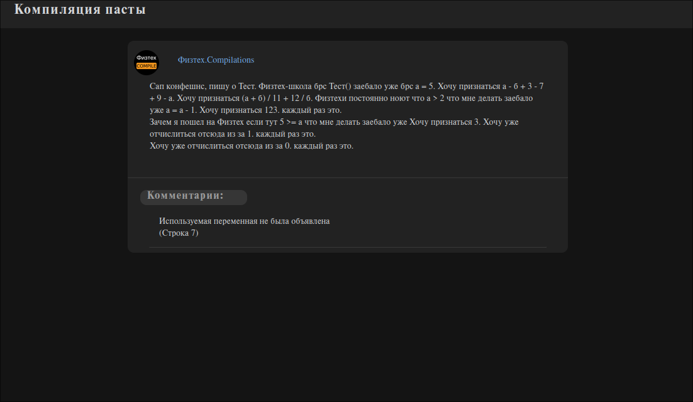

# Компилятор эзотерического языка

## Введение
Данный проект представляет из себя компилятор эзотерического языка, синтаксис которого основан на типичном содержании поста группы 'Физтех.Confessions'. Репозиторий включает в себя компиляторные front end, back end и middle end. Компиляция происходит под архитектуру x86_64 в формате ассемблерного листига (с синтаксисом `nasm`). В дальнейшем планируется добавить возможность создания elf-файлов напрямую без использования сторонних программ.

## Установка и сборка
На данный момент корректная работа программы гарантируется только для семейства ОС GNU/Linux при работе на архитектуре x86_64. Для сборки используется утилита [cmake](https://cmake.org/).

### Необходимые команды
```bash
$ git clone https://github.com/Iprime111/Language
$ cd Language
$ mkdir build && cd build
$ cmake .. -GNinja -DCMAKE_BUILD_TYPE=Release
```

> [!NOTE]
> В данном примере в качестве генератора используется [ninja](https://ninja-build.org/) из-за поддержки многопоточной сборки, однако допускается использование любых систем, поддерживаемых cmake

## Использование программы

### Примеры команд
Компиляция написанной программы производится путем последовательного исполнения трех составляющих компилятора и последующей преобразования ассемблерного листинга в машинный код. Ниже представлен пример использования компилятора (предполагается, что пользователь находится в папке `build`):

``` bash
$ ./bin/frontend -s <FILENAME> -n <NAME_TABLES> -t <TREE_FILE> -d <DUMP_FILE>
$ ./bin/middleend -t <TREE_FILE> -n <NAME_TABLES>
$ ./bin/backend -t <TREE_FILE> -n <NAME_TABLES> > <ASSEMBLY_FILE>
$ nasm -felf64 <ASSEMBLY_FILE> -o <OBJECT_FILE>
$ ld <OBJECT_FILE> -o <EXECUTABLE>
```

### Вывод ошибок
При переводе программы во внутреннее представление (во время работы фронтенда) происходит генерация html файла, содеражащего список всех ошибок, стилизованный под комментарии к записи в социальной сети. Каждый из них содержит краткую информацию о возникшей ошибке и номер строки, на которой она произошла. Ниже представлен скриншот отчета с ошибкой компиляции:



## Работа фронтенда
Первой частью программы, конвертирующей исходный код в синтаксическое дерево является фронтенд. В основе его работы лежит алгоритм рекурсивного спуска, позволяющий по грамматике языка (файл `frontend/doc/Grammar.txt`в данном репозитории) обработать код, предварительно разбитый на лексемы, построив так называемое **абстрактное синтаксическое дерево** (**AST**).
