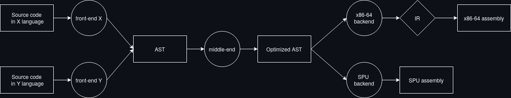
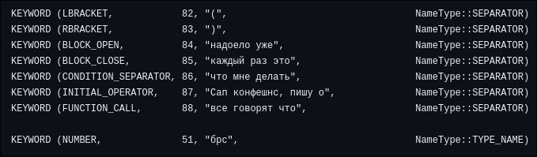

# Компилятор эзотерического языка

## Введение
Данный проект представляет из себя компилятор эзотерического языка, синтаксис которого основан на типичном содержании поста группы 'Физтех.Confessions'. Репозиторий включает в себя компиляторные front-end, back-end и middle-end. Компиляция происходит под архитектуру x86_64 в формате ассемблерного листига (с синтаксисом `nasm`). В дальнейшем планируется добавить возможность создания elf-файлов напрямую без использования сторонних программ.

## Установка и сборка
На данный момент корректная работа программы гарантируется только для семейства ОС GNU/Linux при работе на архитектуре x86_64. Для сборки используется утилита [cmake](https://cmake.org/).

### Необходимые команды
```bash
$ git clone https://github.com/Iprime111/Language
$ cd Language
$ mkdir build && cd build
$ cmake .. -GNinja -DCMAKE_BUILD_TYPE=Release
```

> [!NOTE]
> В данном примере в качестве генератора используется [ninja](https://ninja-build.org/) из-за поддержки многопоточной сборки, однако допускается использование любых систем, поддерживаемых cmake

## Использование программы

### Примеры команд
Компиляция написанной программы производится путем последовательного исполнения трех составляющих компилятора и последующей преобразования ассемблерного листинга в машинный код. Ниже представлен пример использования компилятора (предполагается, что пользователь находится в папке `build`):

``` bash
$ ./bin/frontend -s <FILENAME> -n <NAME_TABLES> -t <TREE_FILE> -d <DUMP_FILE>
$ ./bin/middleend -t <TREE_FILE> -n <NAME_TABLES>
$ ./bin/backend -t <TREE_FILE> -n <NAME_TABLES> > <ASSEMBLY_FILE>
$ nasm -felf64 <ASSEMBLY_FILE> -o <OBJECT_FILE>
$ ld <OBJECT_FILE> -o <EXECUTABLE>
```

## Общая схема работы

На следующей схеме изображена приближенная схема работы компилятора:  



1. Первой стадией (`front-end`) является преобразование исходного кода в абстрактное синтаксическое дерево (**AST**). Как можно заметить, в проекте предусмотрена возможность кросс-компиляции путем использования единого формата AST. 
2. После трансляции в AST, код проходит стадию упрощения и раскрытия операторов дифференцирования (`middle-end`). 
3. Полученное дерево без операторов дифференцирования может быть преобразовано в ассемблер одного из доступных устройств (`back-end`). При этом для архитектуры x86-64 сначала происходит трансляция в промежуточное представление (**IR**), являющееся упрощенной версией LLVM IR, а затем на его основе происходит построение ассемблерного кода.

## front-end

### Схема работы
Первой частью программы, конвертирующей исходный код в синтаксическое дерево является фронтенд. В основе его работы лежит алгоритм рекурсивного спуска, позволяющий по [грамматике](https://github.com/Iprime111/Language/blob/master/frontend/docs/Grammar.txt) языка обработать код, предварительно разбитый на лексемы, построив абстрактное синтаксическое дерево.


Работа фронтенда происходит в несколько этапов:
1. Исходный код разбивается на лексемы, которые сохраняются в массив
2. Лексемы при помощи алгоритма рекурсивного спуска (парсер) преобразуются в синтаксическое дерево. При этом происходит проверка на ошибки в коде. Если таковые были найдены, то построение дерева прекращается.
3. Если дерево было построено, то оно сохраняется в файл. Также, независимо от успеха построения дерева, происходит генерация файла отчета.

### Лексер
Разбиением исходного кода на лексемы занимается часть фронтенда, называемая лексер. Список лексем задается в отдельном [файле](https://github.com/Iprime111/Language/blob/master/SyntaxTree/include/Keywords.def) и может быть легко изменен. Отличительной чертой языка является поддержка лексем из нескольких слов, что помогает приблизить его к письменной речи на русском языке.



*Пример записи лексем*

### Грамматика языка
Для работы парсера необходим список правил, называемый грамматикой. По ней может быть сгенерирован или написан вручную, как в данном случае, код, преобразующий лексемы в дерево. Выше была приведена ссылка на файл с грамматикой для данного проекта.


### Синтаксическое дерево

При написании фронтенда использовался формат синтаксического дерева, разработанный совместно с [SANEKDASH](https://github.com/SANEKDASH), [dmitry131131](https://github.com/dmitry131131) и [Amlola](https://github.com/Amlola). Его описание расположенно в отдельном [репозитории](https://github.com/Iprime111/LanguageStandart).

> [!WARNING]
> На момент написания данного текста перевод стандарта дерева в цифровой вид еще не был окончен

### Вывод ошибок
При переводе программы во внутреннее представление (во время работы фронтенда) происходит генерация html файла, содержащего список всех ошибок, стилизованный под комментарии к записи в социальной сети. Каждый из них содержит краткую информацию о возникшей ошибке и номер строки, на которой она произошла. Ниже представлен скриншот отчета с ошибкой компиляции:


## middle-end

Основная задача middle-end'a состоит в раскрытии операторов дифференцирования (оператор времени компиляции). Второстепенным действием является свертка констант и упрощение выражений, содержащих операции умножения на `0` и `1`, сложения с `0` и подобных. В текущей версии middle-end изменяет полученный на входе файл дерева. Единый стандарт дерева позволяет всем языкам, поддерживающим его, использовать один и тот же middle-end.

## back-end
